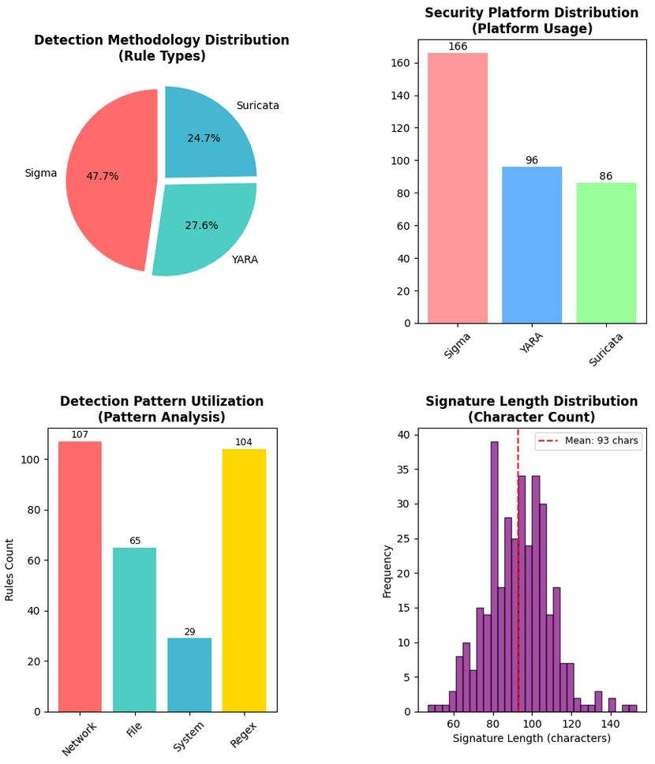
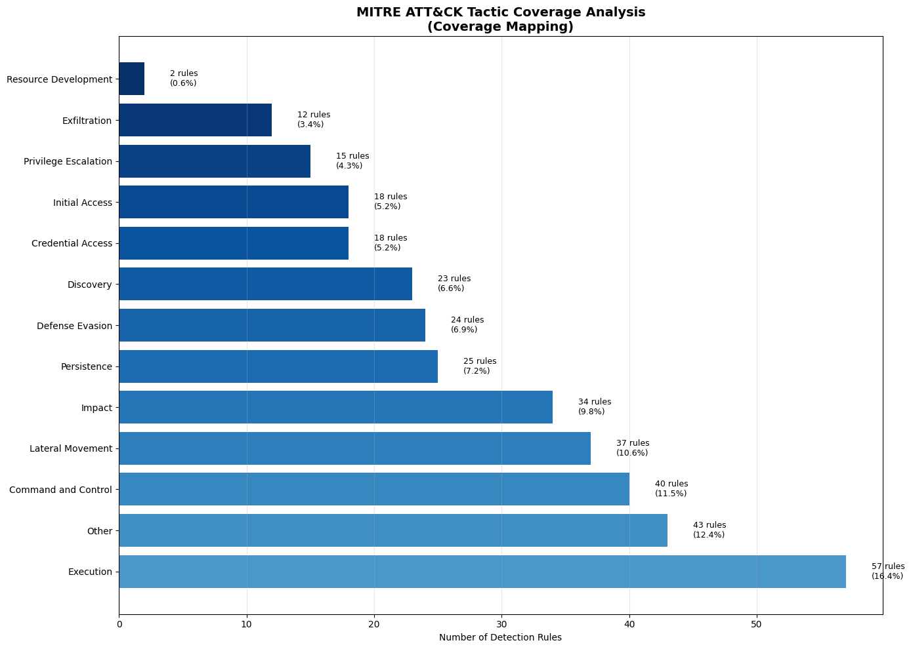
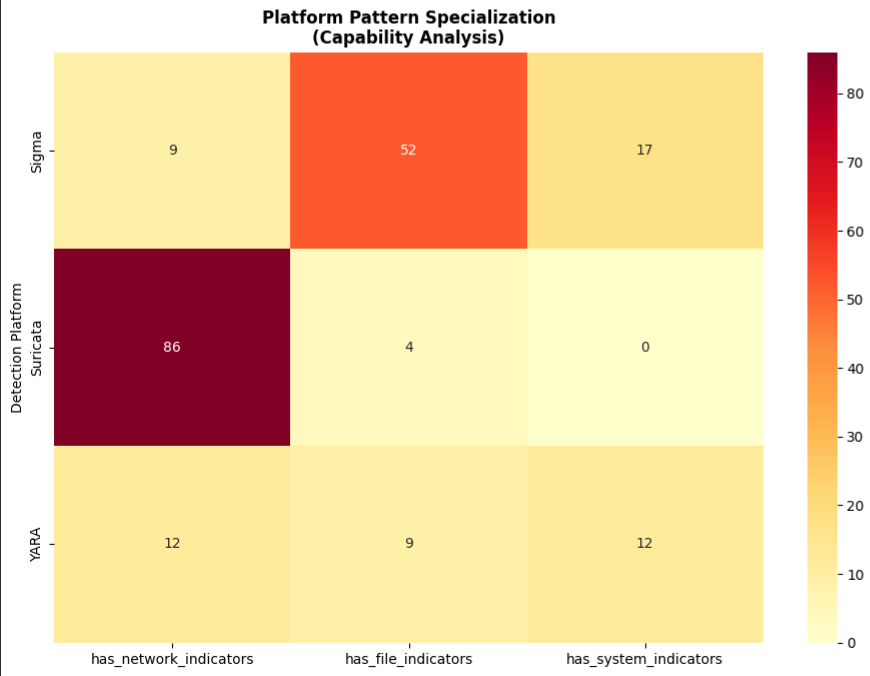
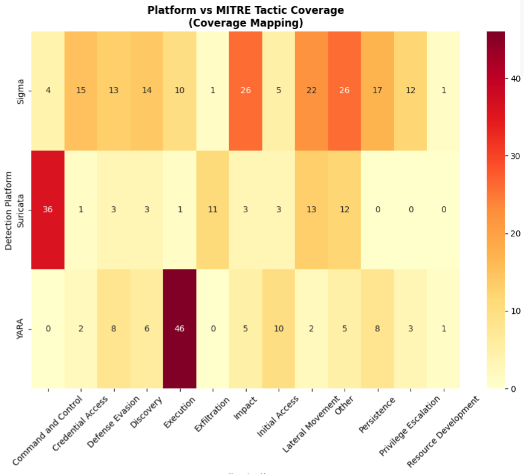
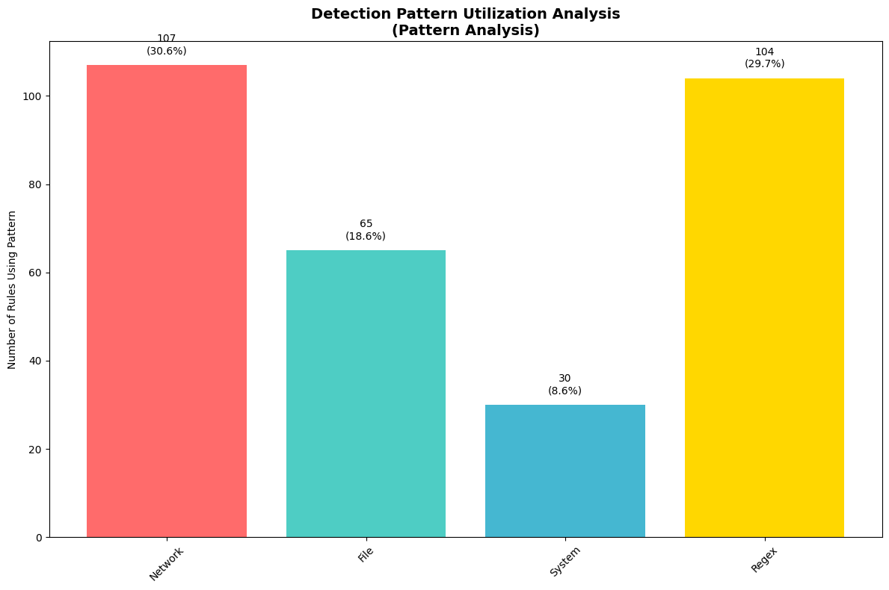
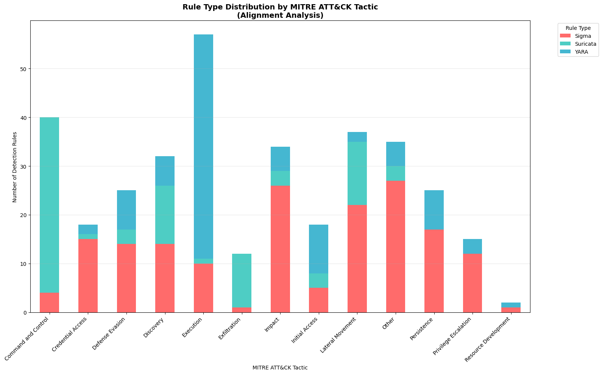
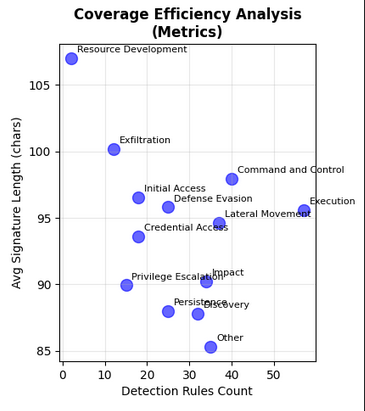

# 🛡️ Blue Team Detection Analytics (v1)

[](https://www.python.org/downloads/)
[](https://jupyter.org/)
[](https://attack.mitre.org/)

> **Comprehensive analysis of enterprise detection capabilities using MITRE ATT&CK framework**  
> *Data-driven insights for security operations optimization*

---

## 📖 About This Project

This project delivers a comprehensive assessment of enterprise security detection capabilities by analyzing 348 detection rules across multiple platforms. Using the MITRE ATT&CK framework as a foundation, it identifies critical coverage gaps, evaluates platform effectiveness, and provides actionable recommendations for security operations teams.

**Key Differentiators:**
- Real-world enterprise detection data analysis
- MITRE ATT&CK framework integration for industry-standard mapping
- Multi-platform coverage assessment (Sigma, YARA, Suricata)
- Quantifiable metrics for detection maturity and effectiveness

---

## 📊 Executive Summary


*Figure 1: Enterprise Detection Capabilities Executive Dashboard*

### 🔍 Strategic Insights at a Glance

#### Detection Methodology Distribution (Top-Left)

- Analysis of rule types and detection approaches across the security portfolio  
- Reveals the balance between different detection methodologies and potential specialization gaps  

#### Security Platform Distribution (Top-Right)

- Overview of security tool deployment and resource allocation  
- Identifies platform concentration risks and optimization opportunities across Sigma, YARA, and Suricata  

#### Detection Pattern Utilization (Bottom-Left)

- Assessment of network, file, and system indicator usage effectiveness  
- Highlights pattern coverage balance and identifies underutilized detection vectors  

#### Signature Complexity Analysis (Bottom-Right)

- Evaluation of rule sophistication and potential performance implications  
- Reveals optimization opportunities for signature efficiency and maintenance overhead  

### 🎯 Executive Value Proposition

This dashboard provides C-level visibility into:

- **Detection Portfolio Health**: Comprehensive assessment of current capabilities  
- **Resource Optimization**: Data-driven platform and methodology investment guidance  
- **Risk Assessment**: Identification of coverage gaps and concentration risks  
- **Operational Efficiency**: Signature complexity insights for performance optimization

**Analysis Scope:** 348 enterprise detection rules assessed for coverage, effectiveness, and optimization opportunities.

### Key Findings at a Glance

| Metric | Value | Insight |
|--------|-------|---------|
| **Total Rules Analyzed** | 348 | Comprehensive enterprise dataset (2 duplicates removed) |
| **MITRE Tactics Covered** | 12/14 (85.7%) | Gaps identified in 2 tactics |
| **Primary Platform** | Sigma (48.3%) | Platform concentration observed |
| **Detection Patterns** | 4 types analyzed | Optimization opportunities identified |
| **Unclassified Rules** | 43 (12.4%) | Classification improvement needed |

---

## 🔍 Detailed Analysis

### 1. Detection Portfolio Scale

**Platform Distribution:**
- **Sigma** (166 rules, 48.3%): Primary detection platform for log-based analysis
- **YARA** (96 rules, 27.6%): File-based detection and malware identification
- **Suricata** (86 rules, 24.7%): Network traffic analysis and threat detection

**Observation:** Platform concentration analysis reveals 48.3% of detection rules deployed on a single platform (Sigma).

### 2. MITRE ATT&CK Coverage Analysis


*Figure 2: Tactical coverage distribution across the MITRE ATT&CK framework*

**Coverage Metrics:**
- ✅ **Well-Covered Tactics**: Execution (41 rules), Command and Control (37 rules), Defense Evasion (36 rules)
- ⚠️ **Moderate Coverage**: Initial Access, Persistence, Lateral Movement
- 🔴 **Critical Gaps**: Reconnaissance (0 rules), Collection (0 rules)

**Observation:** Zero detection coverage in Reconnaissance and Collection phases represents measurable gaps in the detection portfolio.

### 3. Platform Specialization Analysis


*Figure 3: Platform capabilities across network, file, and system indicators*

**Key Insights:**
- **Suricata**: 100% network-focused (86 rules with network indicators)
- **YARA**: File-centric approach (primarily file-based detection)
- **Sigma**: Balanced detection across multiple indicator types

**Observation:** Platform specialization analysis reveals distinct capability profiles suitable for specific detection scenarios.

### 4. Cross-Platform Coverage Matrix


*Figure 4: Platform-tactic coverage heatmap revealing distribution patterns*

**Strategic Findings:**
- **Coverage Distribution**: Execution tactic covered across multiple platforms
- **Single-Platform Tactics**: Some tactics rely on individual platforms for detection
- **Analysis Opportunity**: Cross-platform correlation potential identified for enhanced detection

### 5. Detection Pattern Effectiveness


*Figure 5: Pattern type distribution and utilization rates*

**Pattern Analysis:**
- Network Indicators: 107 rules (30.7%)
- File Indicators: 65 rules (18.7%)
- System Indicators: 29 rules (8.3%)
- Regex Patterns: 104 rules (29.9%)

**Analysis Finding:** System indicators represent 8.6% of detection portfolio compared to network indicators at 30.7%.

### 6. Attack Lifecycle Coverage


*Figure 6: Detection coverage mapped to adversary attack lifecycle*

**Coverage Distribution:**
- Detection rules distributed across 12 of 14 MITRE ATT&CK tactics
- Varying rule counts per tactic indicate specialized coverage areas
- Multi-platform rule deployment observed for critical tactics

### 7. Detection Efficiency Metrics


*Figure 7: Rule count vs. average signature complexity analysis*

**Efficiency Observations:**
- Average signature length: 93 characters across all platforms
- Signature complexity varies by platform and detection type
- Pattern complexity correlates with detection specificity

---

## 🎯 Strategic Recommendations

### Immediate Actions (0-30 days)

1. **🔴 Address Coverage Gaps**
   - Develop detection for Reconnaissance tactic (currently 0 rules)
   - Implement Collection phase monitoring (currently 0 rules)
   - **Analysis Goal:** Achieve coverage across all 14 MITRE tactics

2. **⚠️ Improve Rule Classification**
   - Review **43** "Other" category rules (12.4%) for proper MITRE mapping
   - **Analysis Goal:** Improve classification accuracy from **87.6%** to target threshold

### Short-Term Initiatives (30-90 days)

3. **📊 Optimize Pattern Distribution**
   - Evaluate increasing system indicators from current 8.6% (30 rules)
   - Assess balance between detection pattern types
   - **Analysis Goal:** More balanced pattern utilization across categories

4. **🔧 Platform Distribution Assessment**
   - Review Sigma concentration (currently 48.3%, 168 rules)
   - Evaluate platform diversity opportunities
   - **Analysis Goal:** Assess optimal platform distribution strategy

### Long-Term Strategy (90-180 days)

5. **🚀 Cross-Platform Integration**
   - Explore multi-pattern detection correlation opportunities (currently 50%)
   - Develop correlation rules for critical tactics
   - **Analysis Goal:** Enhanced detection through platform integration

---

## 📈 Analysis Metrics & Observations

### Current State Assessment

| Metric | Current Value | Observation |
|--------|--------------|-------------|
| **Total Rules** | 348 rules | 2 duplicates removed from original 350 |
| **MITRE Coverage** | 85.7% (12/14) | Reconnaissance & Collection tactics undefended |
| **Platform Distribution** | Sigma 48.3%, YARA 27.6%, Suricata 24.7% | Concentration in primary platform |
| **System Indicators** | 8.6% (30 rules) | Lower than network indicators (30.7%, 107 rules) |
| **Classification** | 87.6% mapped | 43 rules (12.4%) unclassified |
| **Multi-Pattern Rules** | 174 rules (50.0%) | Balanced single/multi-pattern distribution |

### Strategic Improvement Priorities

- **Critical Coverage Gaps:** Reconnaissance and Collection tactics currently undefended
- **Pattern Utilization:** System indicators (8.6%, 30 rules) significantly trail network indicators (30.7%, 107 rules)
- **Taxonomy Alignment:** 43 rules (12.4%) require MITRE framework classification
- **Platform Distribution:** Sigma concentration (48.3%, 168 rules) indicates potential diversification opportunity

---

## 🛠️ Technical Implementation

### Technology Stack

```python
Python 3.8+          # Core analysis language
├── pandas           # Data manipulation and analysis
├── numpy            # Numerical computing
├── matplotlib       # Statistical visualizations
├── seaborn          # Enhanced data visualization
├── attackcti        # MITRE ATT&CK integration
└── re               # Advanced pattern detection

Jupyter Notebook     # Reproducible analysis workflow
MITRE ATT&CK v12     # Industry-standard threat taxonomy
```

### Analysis Methodology

1. **Data Collection:** Enterprise detection rules from Sigma, YARA, Suricata platforms
2. **MITRE Mapping:** Technique-to-tactic alignment using official STIX 2.0 data or enhanced static mapping
3. **Pattern Analysis:** Network, file, and system indicator identification and classification
4. **Gap Assessment:** Identification of uncovered attack techniques and phases
5. **Metrics Calculation:** Quantitative assessment of detection portfolio characteristics

### Key Analytical Components

- **Coverage Gap Analysis:** Set-based identification of uncovered MITRE tactics
- **Pattern Classification:** Regex-based detection of indicator types in rule signatures
- **Platform Distribution:** Statistical analysis of rule allocation across platforms
- **Maturity Scoring:** Multi-dimensional assessment framework (6 metrics, 0-100 scale)

---

## 🚀 Getting Started

### Prerequisites

```bash
Python 3.8 or higher
pip (Python package manager)
Jupyter Notebook or JupyterLab
```

### Installation

```bash
# Clone the repository
git clone https://github.com/Vit-O-Anjos/data-science-portfolio_0.git

# Navigate to project directory
cd data-science-portfolio_0/cybersecurity-analytics/blue-team-detection-analytics

# Install required packages
pip install -r requirements.txt

# Optional: Create virtual environment (recommended)
python -m venv venv
source venv/bin/activate  # On Windows: venv\Scripts\activate
pip install -r requirements.txt
```

### Quick Start

```bash
# Launch Jupyter Notebook
jupyter notebook

# Open the main analysis notebook
# File: detection_coverage_analysis_v1.ipynb

# Run all cells to reproduce the analysis
# Visualizations will be saved to: visualisations/
```

### Project Structure

```
blue-team-detection-analytics/
├── detection_coverage_analysis_v1.ipynb  # Main analysis notebook
├── BLUE_TEAM_DEFENSE_DATASET.jsonl      # Detection rules dataset
├── visualisations/                        # Generated charts and graphs
│   ├── 01_mitre_tactic_coverage.png
│   ├── 02_platform_pattern_specialization.png
│   ├── 03_cross_platform_tactic_coverage.png
│   ├── 04_detection_pattern_utilization.png
│   ├── 05_rule_type_by_tactic.png
│   ├── 06_coverage_efficiency.png
│   └── 07_executive_dashboard_2x2.png
├── requirements.txt                       # Python dependencies
└── README.md                             # This file
```

---

## 📊 Dataset Information

### Data Sources

- **348 detection rules** from enterprise security operations (2 duplicates removed)
- **Multi-platform coverage:** Sigma (log-based), YARA (file-based), Suricata (network-based)
- **MITRE ATT&CK v12:** Industry-standard adversary tactics and techniques framework
- **Real-world patterns:** Production detection signatures from operational environments

### Data Schema

**Original JSONL Format (Input):**
```json
{
  "rule_id": 1,
  "platform": "Sigma|YARA|Suricata",
  "rule_type": "Network|File|Process|Registry",
  "signature": "detection rule content...", 
  "mapped_technique": "T1059.001"
}
```

**Enhanced Features (Computed During Analysis):**
```python
# Derived from mapped_technique using MITRE ATT&CK framework
'mitre_tactic': 'Execution'  # Maps T1059 → Execution tactic

# Pattern detection features (extracted from signature content)
'signature_length': 150  # Character count
'has_network_indicators': True   # Contains network IoCs
'has_file_indicators': False     # Contains file-based IoCs  
'has_system_indicators': True    # Contains system-level IoCs
'uses_regex': True               # Uses regex patterns
```

## 🎯 Use Cases & Applications

### For Detection Engineers
- ✅ Identify coverage gaps in specific MITRE techniques
- ✅ Analyze detection patterns across platforms
- ✅ Assess rule distribution and specialization
- ✅ Benchmark detection capabilities using MITRE ATT&CK framework

### For Security Architects
- ✅ Evaluate detection portfolio coverage metrics (12/14 tactics, 348 rules analyzed)
- ✅ Analyze platform distribution patterns
- ✅ Assess cross-platform coverage opportunities
- ✅ Review detection strategy alignment with MITRE framework

### For SOC Management
- ✅ Understand operational coverage across tactics
- ✅ Identify priority areas for detection development
- ✅ Track metrics for portfolio assessment
- ✅ Visualize security posture for stakeholder communication

### For Security Leadership
- ✅ Review quantitative security metrics
- ✅ Assess detection capability maturity
- ✅ Evaluate framework alignment (MITRE ATT&CK)
- ✅ Guide strategic security program planning

---

## 📚 Documentation & Resources

### Analysis Components
- 📊 **Executive Dashboard** - 14-panel strategic overview
- 🔬 **MITRE Coverage Analysis** - Tactic and technique mapping
- 🎯 **Platform Assessment** - Multi-platform capability evaluation
- 📈 **Pattern Analysis** - Detection indicator utilization

### External Resources
- [MITRE ATT&CK Framework](https://attack.mitre.org/) - Threat intelligence taxonomy
- [Sigma Project](https://github.com/SigmaHQ/sigma) - Generic signature format
- [YARA Documentation](https://yara.readthedocs.io/) - Malware identification tool
- [Suricata](https://suricata.io/) - Network threat detection engine

---

## 📫 Contact & Connect

**Vitor Anjos**
- 🔗 [LinkedIn](https://www.linkedin.com/in/vitor-anjos-33242a107/)
- 💼 [Portfolio](https://github.com/Vit-O-Anjos/data-science-portfolio)

---

## 🙏 Acknowledgments

- **MITRE Corporation** for the ATT&CK framework and community resources
- **Sigma Project** for standardized detection rule format
- **Open-source security community** for tools and inspiration
- **Enterprise security teams** for real-world detection insights
- **Kaggle** for the detection rules data

---

## ⭐ Star This Project

If you find this analysis valuable for security operations, please consider giving it a star! 

[](https://github.com/Vit-O-Anjos/data-science-portfolio)

---

<div align="center">

**🛡️ Detect Better. Respond Faster. Defend Smarter.**

*Professional detection analytics for modern security operations*

Made with 🎨 and 🔐 by [Vitor Anjos](https://github.com/Vit-O-Anjos)

</div>
