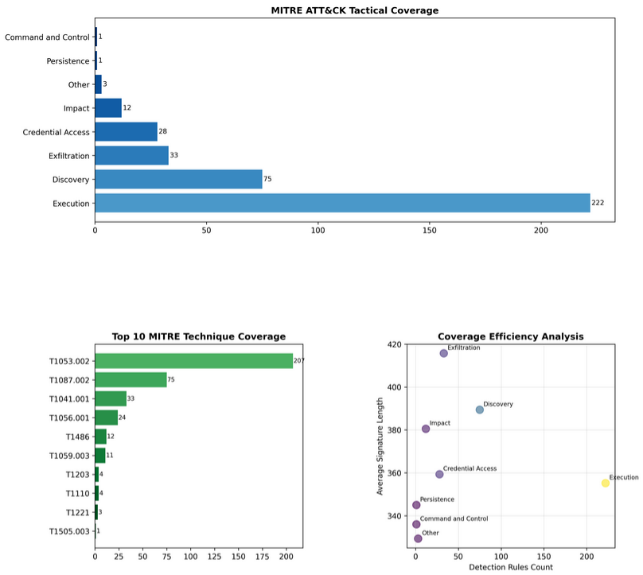
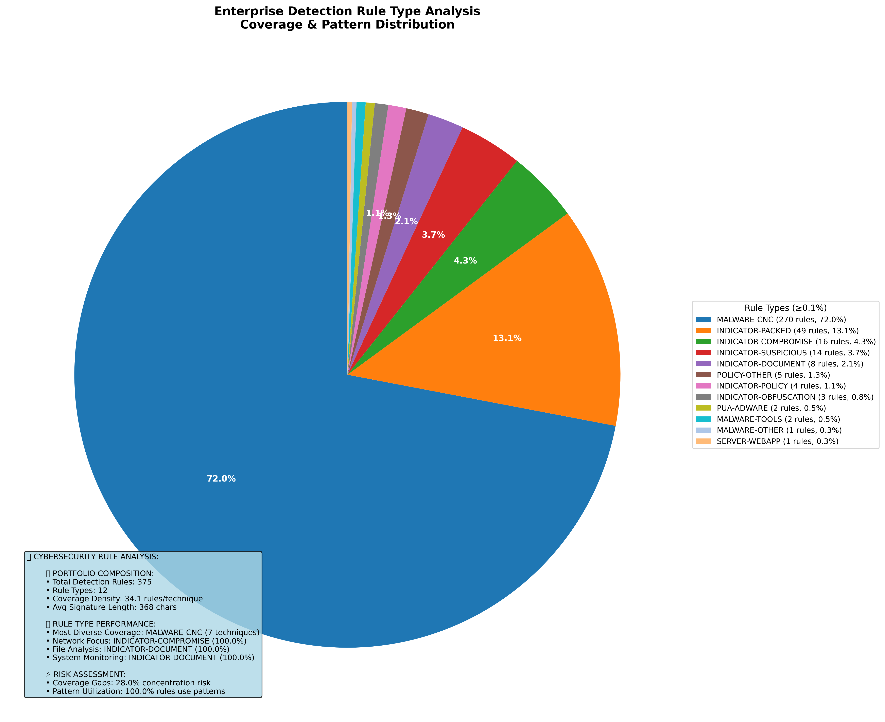
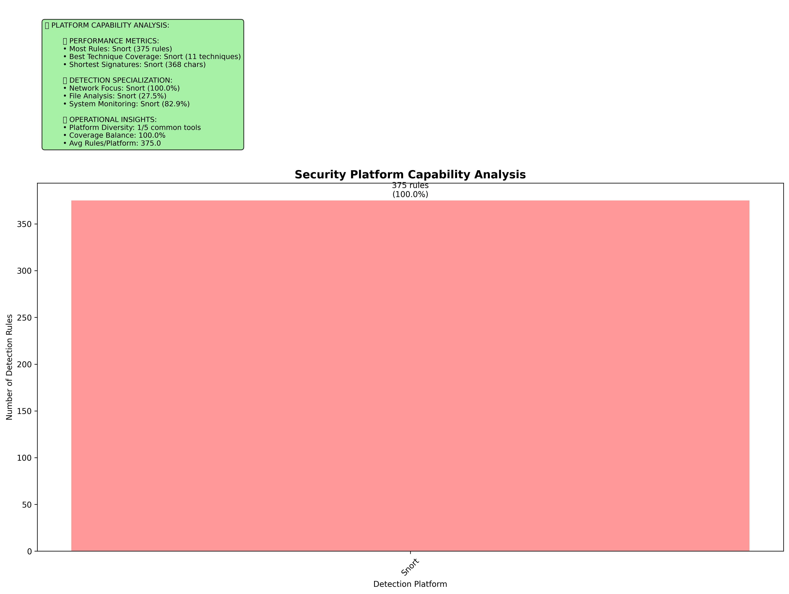
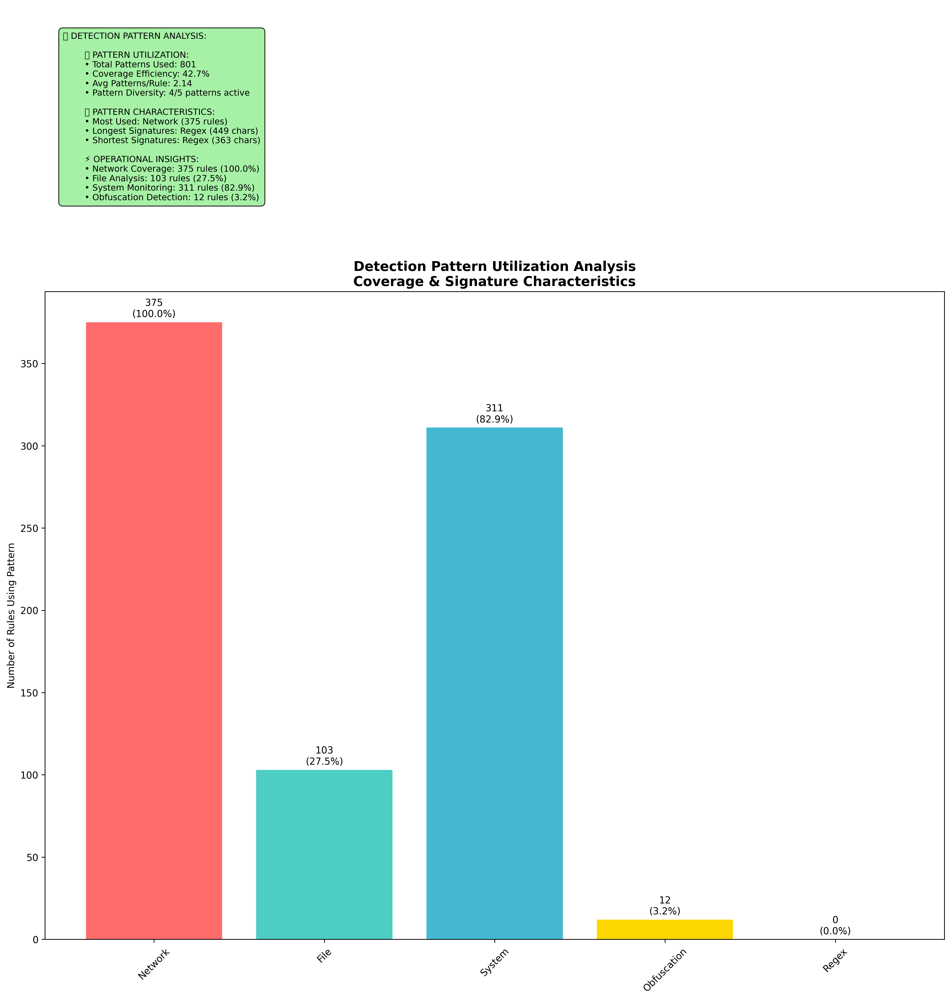
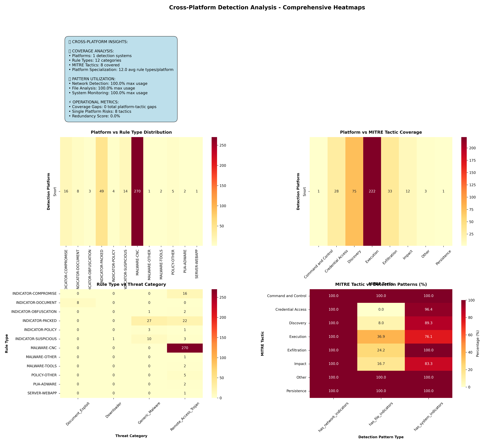
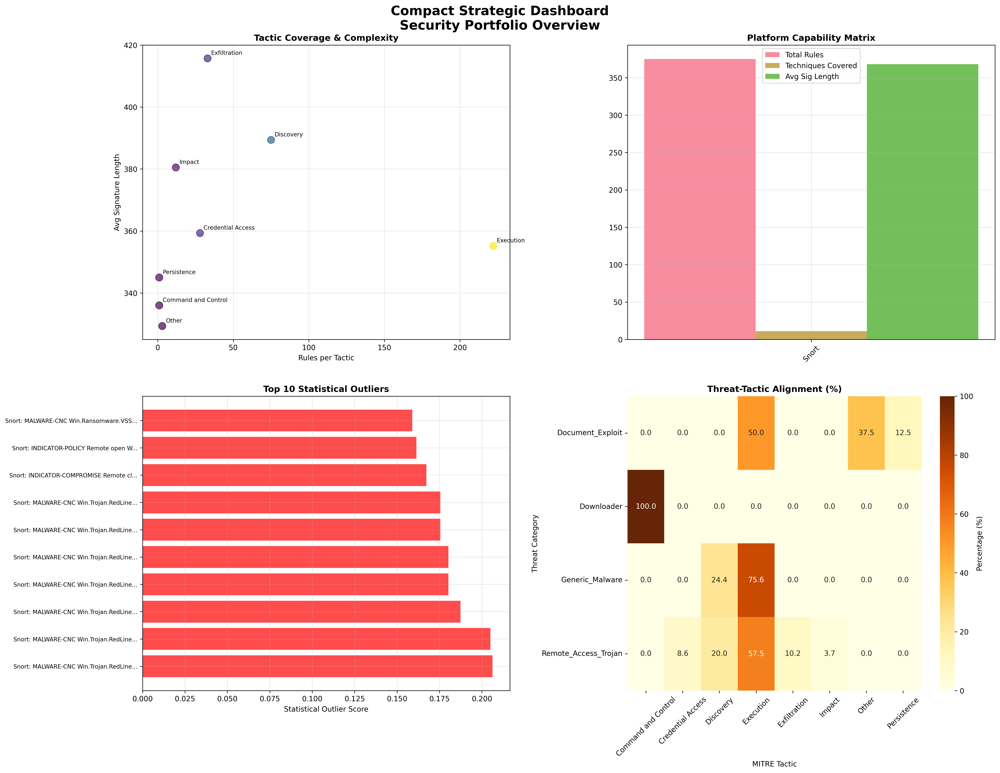

# Enterprise Detection Analytics & Rule Intelligence Platform (v5)

[](https://www.python.org/downloads/)
[](https://jupyter.org/)
[](https://code.visualstudio.com/)
[](https://colab.research.google.com/)
[](https://attack.mitre.org/)

A universal Python-based analytics platform for analyzing cybersecurity detection rules across multiple security tools and frameworks. Works seamlessly in Colab, Jupyter, and VS Code.

## 🚀 Universal Compatibility

Now supporting all major Python environments:

- ✅ **Google Colab** - Full interactive experience with file uploads
- ✅ **Jupyter Notebook** - Complete functionality with local file access
- ✅ **VS Code** - Full IDE integration with debugging capabilities
- ✅ **JupyterLab** - Advanced notebook interface support

### Multi-Environment Features

| Environment | File Loading | Visualization | Interactive Widgets |
|------------|--------------|---------------|-------------------|
| Google Colab | ✅ Upload widget | ✅ Direct display | ✅ Full support |
| Jupyter Notebook | ✅ Local files | ✅ Direct display | ✅ Full support |
| VS Code | ✅ Local files | ✅ Direct display | ✅ Full support |
| JupyterLab | ✅ Local files | ✅ Direct display | ✅ Full support |

## Overview

This platform provides automated analysis and visualization of detection rules from various security platforms (Snort, YARA, Sigma, Elastic). It parses rule files, maps them to the MITRE ATT&CK framework, and generates detailed analytical visualizations to help security teams understand their detection coverage.

## Key Features

### Universal Rule Parsing

- **Multi-format Support**: Automatically detects and parses Snort/Suricata, YARA, Sigma, and Elastic rule formats
- **Auto-detection**: Intelligently identifies rule format based on content patterns and file extensions
- **MITRE ATT&CK Mapping**: Maps detection rules to 200+ MITRE ATT&CK techniques using pattern matching
- **Feature Engineering**: Extracts detection patterns (network, file, system indicators) and calculates signature characteristics

### Universal Data Loading

- **Smart Auto-detection**: Automatically detects file formats and converts raw rules to analytics-ready format
- **Multi-source Support**: Works with uploaded files (Colab) and local file paths (Jupyter/VS Code)
- **Format Agnostic**: Handles both ready-to-analyze formats and raw rule files with automatic conversion
- **Error Resilient**: Robust error handling for malformed files and format inconsistencies

### Comprehensive Analytics

The platform performs three types of analysis:

1. **Coverage Analysis**
   - MITRE ATT&CK tactic and technique coverage
   - Platform-specific coverage distribution
   - Detection gap identification

2. **Pattern Analysis**
   - Detection pattern utilization (network, file, system indicators)
   - Pattern combination effectiveness
   - Cross-platform pattern comparison

3. **Signature Analysis**
   - Signature length distribution and statistics
   - Complexity metrics
   - Platform-specific characteristics

### Visualization Engine

Generates **30+ professional visualizations** across two dashboard types:

- **Executive Dashboard** (14 visualizations): High-level security posture overview
- **Technical Analysis** (17 visualizations): Detailed analytical charts with comprehensive statistics

## Technical Specifications

- **Language**: Python 3.x
- **Code Size**: 600+ lines of production-quality code
- **Architecture**: 5-stage modular pipeline
- **Visualization Library**: Matplotlib, Seaborn
- **Data Processing**: Pandas, NumPy
- **Compatibility**: Universal support for Colab, Jupyter, VS Code

## Installation

```bash
# Clone the repository
git clone https://github.com/yourusername/detection-analytics-platform.git
cd detection-analytics-platform

# Install required dependencies
pip install pandas matplotlib seaborn numpy ipywidgets
```

**Optional**: For official MITRE ATT&CK data integration:
```bash
pip install attackcti
```

## Usage

### In Google Colab

1. Upload the notebook to Google Colab
2. Run all cells to initialize the platform
3. Click "🚀 Analyze ANY Detection Rules Data"
4. Upload your detection rules file (any supported format)
5. View generated visualizations and reports

### In Jupyter Notebook / VS Code

1. Open the notebook in your preferred environment
2. Run all cells to initialize the platform
3. Use the file path input to analyze local detection rule files
4. View generated visualizations directly in the notebook

### Local File Analysis (Jupyter/VS Code)

```python
# For local file analysis in Jupyter/VS Code
file_path = "/path/to/your/detection_rules.rules"
# The platform automatically detects format and processes the file
```

## Supported File Formats

**Ready-to-Analyze**:
- CSV files with detection rules
- JSON/JSONL rule data
- Parquet analytics data

**Raw Rules (Auto-conversion)**:
- Snort/Suricata rules (`.rules`, `.snort`, `.suricata`)
- YARA rules (`.yar`, `.yara`)
- Sigma rules (`.yml`, `.yaml`)
- Elastic rules (`.json`)
- Generic detection rules (`.txt`, `.conf`)

## Environment-Specific Setup

### Google Colab
- No additional setup required
- File upload via interactive widget
- Direct visualization display

### Jupyter Notebook
```bash
# Start Jupyter
jupyter notebook
# Open detection_analytics_platform.ipynb
```

### VS Code
1. Install Python extension and Jupyter support
2. Open the `.ipynb` file
3. Select Python kernel
4. Run all cells

### JupyterLab
```bash
pip install jupyterlab
jupyter lab
```

## Sample Visualizations

### MITRE ATT&CK Coverage Analysis Suite
Comprehensive three-panel view from the executive dashboard showing tactical coverage, top techniques, and efficiency analysis:


*Figure 1: MITRE ATT&CK coverage analysis suite showing tactical distribution, top techniques, and efficiency metrics*

### Rule Type Distribution
Comprehensive analysis of detection methodology distribution with detailed statistics:


*Figure 2: Detection rule type distribution across the security portfolio*

### Platform Utilization
Multi-platform detection capability analysis with performance metrics:


*Figure 3: Security platform utilization and capability distribution*

### Detection Pattern Utilization
Pattern extraction and analysis showing network, file, and system indicator usage:


*Figure 4: Detection pattern utilization across network, file, and system indicators*

### Cross-Platform Heatmaps
Advanced correlation analysis across platforms, tactics, and threat categories:


*Figure 5: Cross-platform heatmap analysis showing platform-tactic-threat correlations*

### Compact Strategic Dashboard
Four-panel strategic overview with advanced metrics including outlier detection and capability matrices:


*Figure 6: Compact strategic dashboard with multi-dimensional security metrics*

## 🚀 Live Demo & Complete Output

### 📊 Interactive Notebook
- 📓 [View Full Notebook on nbviewer](https://nbviewer.org/github/Vit-O-Anjos/data-science-portfolio/blob/main/cybersecurity-analytics/enterprise-rule-intelligence/enterprise_intelligence_platform.ipynb)

### 🛠️ Interactive Version (Ready to Run)
- 🎮 [Run in Google Colab](https://colab.research.google.com/github/Vit-O-Anjos/data-science-portfolio/blob/main/cybersecurity-analytics/enterprise-rule-intelligence/enterprise_intelligence_platform.ipynb)

**To use sample data:**

**Option 1: Direct Downloads**
- 📄 [snort3.rules](https://raw.githubusercontent.com/Vit-O-Anjos/data-science-portfolio/main/cybersecurity-analytics/enterprise-rule-intelligence/data/snort3.rules)
- 📄 [snort3-community.rules](https://raw.githubusercontent.com/Vit-O-Anjos/data-science-portfolio/refs/heads/main/cybersecurity-analytics/enterprise-rule-intelligence/data/snort3-community.rules)
- 📄 [snort2.rules](https://raw.githubusercontent.com/Vit-O-Anjos/data-science-portfolio/main/cybersecurity-analytics/enterprise-rule-intelligence/data/snort2.rules)
- 📄 [BLUE_TEAM_DEFENSE_DATASET.jsonl](https://raw.githubusercontent.com/Vit-O-Anjos/data-science-portfolio/main/cybersecurity-analytics/enterprise-rule-intelligence/data/BLUE_TEAM_DEFENSE_DATASET.jsonl)

**Option 2: Manual Download**
1. Go to the [`data/`](https://github.com/Vit-O-Anjos/data-science-portfolio/tree/main/cybersecurity-analytics/enterprise-rule-intelligence/data) folder
2. Click each file → Click "Download" button
3. Save files to your computer

**Then:**
1. Open the Colab notebook above  
2. Upload the downloaded file when prompted

### 📁 Project Outputs
- 📈 [View Complete Analysis Output](DEMO_OUTPUT.md)
- 🖼️ [All Generated Visualizations](visualisations/)

## Architecture

### Enhanced Universal Data Loader
- **Environment Detection**: Automatically adapts to Colab, Jupyter, or VS Code
- **Multi-format Handling**: Processes both analytics-ready and raw rule files
- **Path-based Loading**: Supports local file paths in Jupyter/VS Code
- **Upload Handling**: Manages file uploads in Colab environment

### Stage 1: Universal Rule Converter
- Format detection and parsing
- MITRE ATT&CK technique mapping
- Threat categorization
- Feature extraction

### Stage 2: Core Analytics Engine
- Data loading and validation
- MITRE taxonomy integration
- Feature engineering

### Stage 3: Analytics Modules
- Coverage Analyzer
- Pattern Analyzer
- Statistical analysis

### Stage 4: Visualization Engine
- Executive Dashboard (14 charts)
- Technical Analysis (17 individual charts)
- Professional styling and statistics

### Stage 5: Unified Main Engine
- Automatic format detection
- End-to-end analytics workflow
- Report generation
- Multi-environment compatibility

## Output

The platform generates:

1. **Executive Dashboard**: Single comprehensive image with 14 integrated visualizations
2. **Individual Technical Charts**: 17 detailed analytical visualizations
3. **Reports Directory**: All visualizations saved as high-resolution PNG files (300 DPI)
4. **Console Report**: Statistical summary with key metrics

## MITRE ATT&CK Integration

The platform includes comprehensive MITRE ATT&CK mapping:

- **200+ Technique Mappings**: Covers major ATT&CK techniques and sub-techniques
- **14 Tactical Categories**: Maps to all standard MITRE tactics
- **Pattern-based Detection**: Uses keyword and regex pattern matching
- **Official Data Support**: Optional integration with MITRE STIX/TAXII server via `attackcti` library

## Statistical Analysis Features

Each visualization includes comprehensive statistics:
- Distribution metrics (mean, median, std deviation)
- Coverage percentages and gaps
- Pattern correlations
- Platform-specific characteristics
- Operational insights

## Project Structure

```
detection-analytics-platform/
├── README.md
├── detection_analytics_platform.ipynb
├── visualizations/
│   ├── executive_dashboard.png
│   ├── 1_rule_type_distribution.png
│   ├── 2_platform_utilization.png
│   ├── 3_mitre_tactic_coverage.png
│   ├── 7_detection_patterns.png
│   └── 13_cross_platform_heatmaps.png
└── reports/
    └── (generated visualizations)
```

## Technical Approach

### 🔍 Source-First Rule Analysis

The platform specializes in analyzing human-readable source rule files - the format used by detection engineers for development, testing, and optimization. This approach enables:

- **Rule Development Focus**: Analyze rules during creation and refinement phases
- **Cross-Platform Consistency**: Standardized analysis regardless of deployment target
- **Export-Ready Formats**: Compatible with standard export functions from major security platforms

### 🎯 Pattern-Based MITRE ATT&CK Mapping

Uses comprehensive pattern matching against 200+ MITRE techniques, providing:

- **Deterministic Results**: Consistent, reproducible mapping logic
- **Transparent Methodology**: Clear, explainable technique associations
- **High-Performance Processing**: Fast analysis of large rule sets
- **Battle-Tested Coverage**: Proven patterns from real-world detection engineering

### 🌐 Universal Environment Support

Enhanced compatibility features:

- **Smart Environment Detection**: Automatically adapts UI for Colab vs local environments
- **Unified Data Loading**: Single interface for both uploaded files and local paths
- **Consistent Visualization**: Same high-quality outputs across all platforms
- **Robust Error Handling**: Graceful fallbacks for environment-specific limitations

> 💡 **Professional Context**: This methodology aligns with enterprise detection engineering workflows where source rule analysis and deterministic mapping are preferred for auditing and optimization

## Dependencies

**Core Requirements**:
- `pandas`: Data processing
- `matplotlib`: Visualization
- `seaborn`: Statistical visualizations
- `numpy`: Numerical operations
- `ipywidgets`: Interactive interface

**Optional**:
- `attackcti`: Official MITRE ATT&CK data (recommended)

## Troubleshooting

### Common Issues

**File Upload Not Working (Jupyter/VS Code)**
- Use local file path instead of upload widget
- Ensure file path is accessible to the notebook

**Visualization Display Issues**
- Restart kernel and run all cells
- Check matplotlib backend configuration

**MITRE Mapping Errors**
- Install `attackcti` for official data
- Platform falls back to enhanced static mapping

## 📫 Contact & Connect

- 🔗 [LinkedIn](https://www.linkedin.com/in/vitor-anjos-33242a107/?skipRedirect=true)  
- 💼 [Portfolio](https://github.com/Vit-O-Anjos/data-science-portfolio)  

## 🙏 Acknowledgments

- MITRE ATT&CK Framework for threat taxonomy
- Security community for rule format documentation

## ⭐ Star This Project

If you find this analysis valuable for security operations, please consider giving it a star!


> Transform raw detection rules into actionable security intelligence—identify coverage gaps, optimize performance, and make data-driven decisions about your defensive capabilities.

<div align="center">

## 🛡️ Map Your Coverage. Optimize Your Rules. Strengthen Your Defense.

**Enterprise detection analytics for data-driven security engineering**

*Now with universal compatibility: Colab • Jupyter • VS Code*

---

Made with 🏗️ and 🔐 by **Vitor Anjos**

</div>
