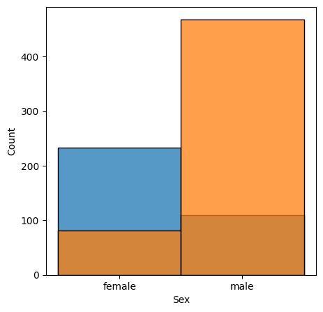
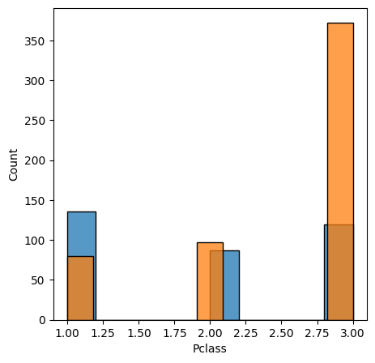
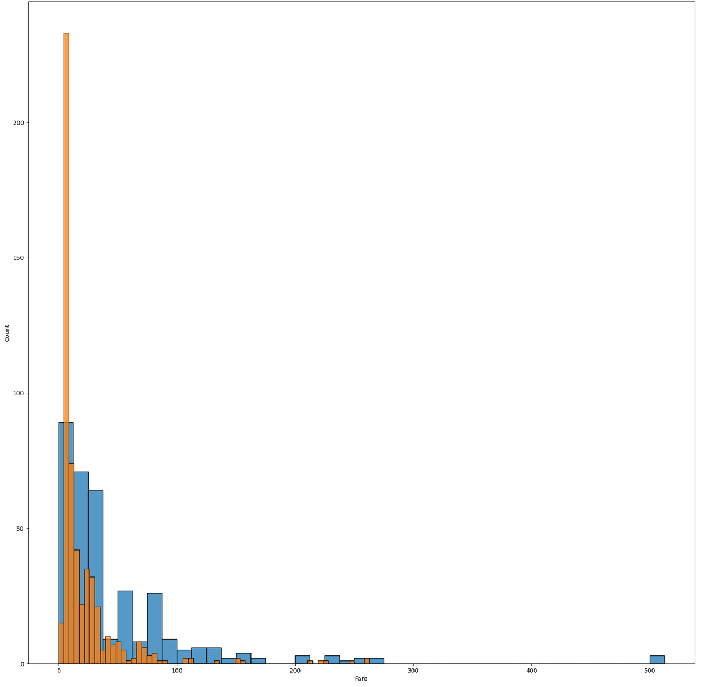
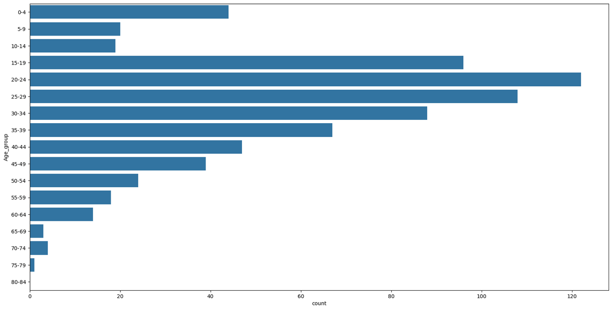

# Titanic Survival Analysis

## 📊 Project Overview
An exploratory data analysis investigating the demographic and socio-economic factors that influenced passenger survival rates during the Titanic disaster.

## 🔍 Key Insights
- **Gender Disparity**: 74% of women survived vs only 19% of men
- **Class Privilege**: 63% of 1st class passengers survived vs 24% of 3rd class  
- **Age Factor**: Children under 15 had significantly higher survival rates
- **Economic Influence**: Higher fare payers had better survival chances

## 📈 Analysis Highlights
- Data cleaning and missing value handling
- Feature engineering (Age groups)
- Statistical analysis of survival patterns
- Multiple visualization techniques

## 🛠 Technologies Used
- Python, Pandas, NumPy
- Seaborn, Matplotlib
- Jupyter Notebook

## 📊 Visualizations

### Survival by Gender


### Survival by Passenger Class  


### Survival by Fare


### Age Distribution



## 💡 Business Impact

This analysis demonstrates how data storytelling can reveal historical patterns and inform safety protocols for modern transportation systems.

## 🚀 Quick Start
```bash
pip install -r requirements.txt
jupyter notebook titanic_analysis.ipynb
