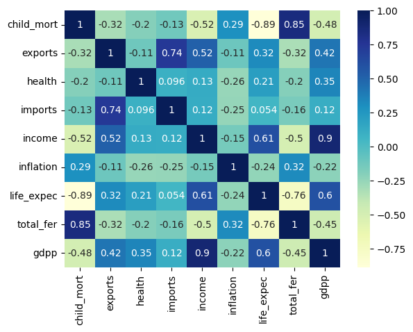
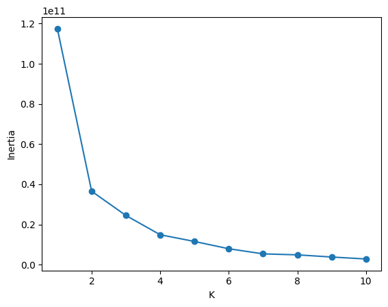
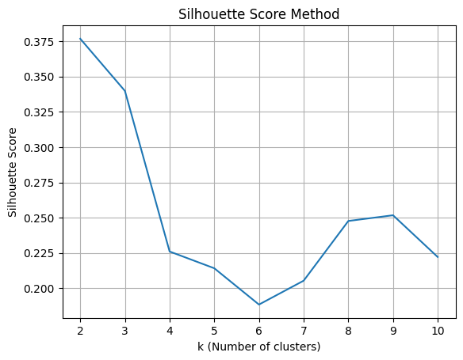
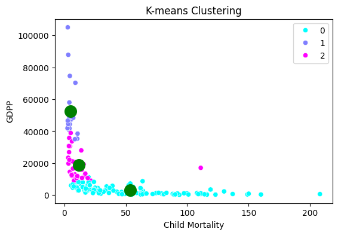
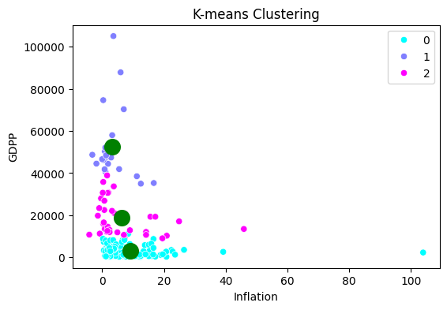
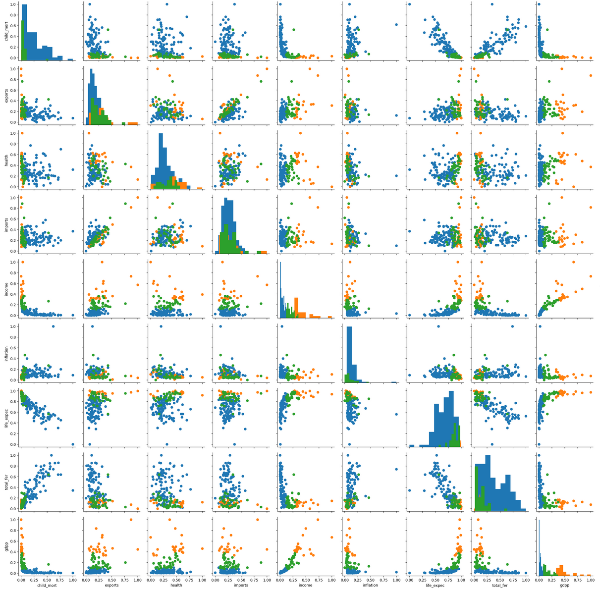

# 🌍 Countries Categorization Project

## 📊 Overview
This project groups countries based on socio-economic and health factors to determine their development status using K-means clustering.

## 📁 Dataset Attributes
- 🏴‍☠️ **country**: Name of the country
- 👶 **child_mort**: Death rate of children under 5 years of age per 1000 live births
- 📤 **exports**: Exports of goods and services per capita (% of GDP per capita)
- 🏥 **health**: Total health spending per capita (% of GDP per capita)
- 💰 **income**: Net income per person
- 📈 **inflation**: Annual growth rate of total GDP
- 🎂 **life_expec**: Average life expectancy of newborns
- 👨‍👩‍👧‍👦 **total_fer**: Number of children born per woman
- 🏛️ **gdpp**: GDP per capita

## 🔬 Methodology
- ✅ Loaded and explored dataset (167 countries, 9 features)
- ✅ Verified no missing values
- 📊 Visualized feature relationships via scatter plots, correlation heatmaps, and pair plots
- ⚖️ Normalized features using MinMaxScaler
- 🎯 Selected clusters using elbow method and silhouette scores
- 🎪 Applied K-means clustering (K=3) with fixed random seed for reproducibility 
- 🏷️ Labeled clusters as: Least Developed, Developed, Developing

## 📈 Results & Visualizations

### Results  
- Clusters varied significantly in child mortality, GDP per capita, and inflation rates  
- Silhouette score: 0.600, indicating reasonable cluster separation  
- Visualizations show developed countries with low child mortality and high GDP, least developed with opposite traits, and developing countries in between  
- Inflation generally decreases as GDP per capita increases  
- Child mortality inversely correlates with GDP per capita

 ### Visualizations

### Feature Correlation Analysis

### Cluster Selection

### Cluster Results

## 💼 Business Applications
- 🎯 Inform policy decision making and targeted interventions
- 📊 Risk assessment and resource allocation planning
- 📈 Economic development analysis and forecasting
- 🆘 Humanitarian aid prioritization based on health and economic indicators

## Usage  
1. Install dependencies:  

pip install -r requirements.txt

2. Run the Jupyter notebook to explore analysis and results:  

jupyter notebook clustering_analysis.ipynb
