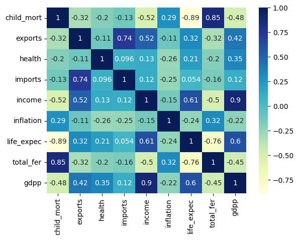
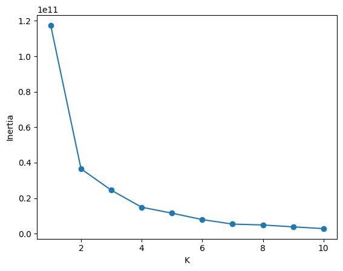
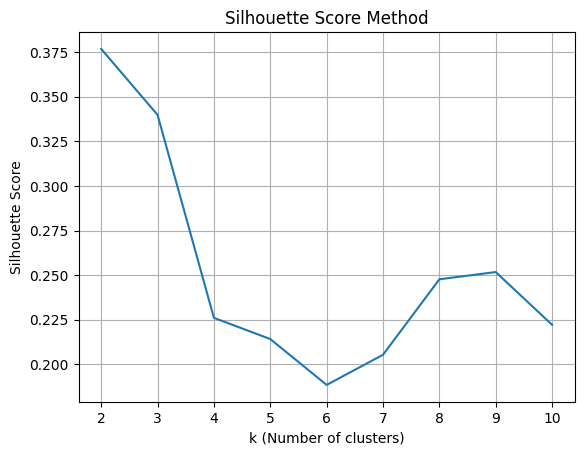
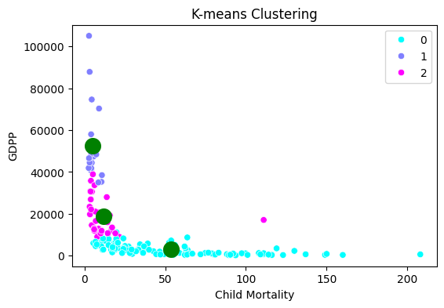
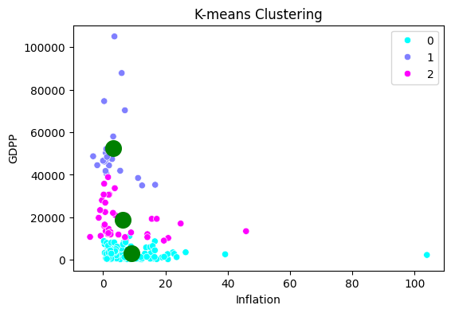
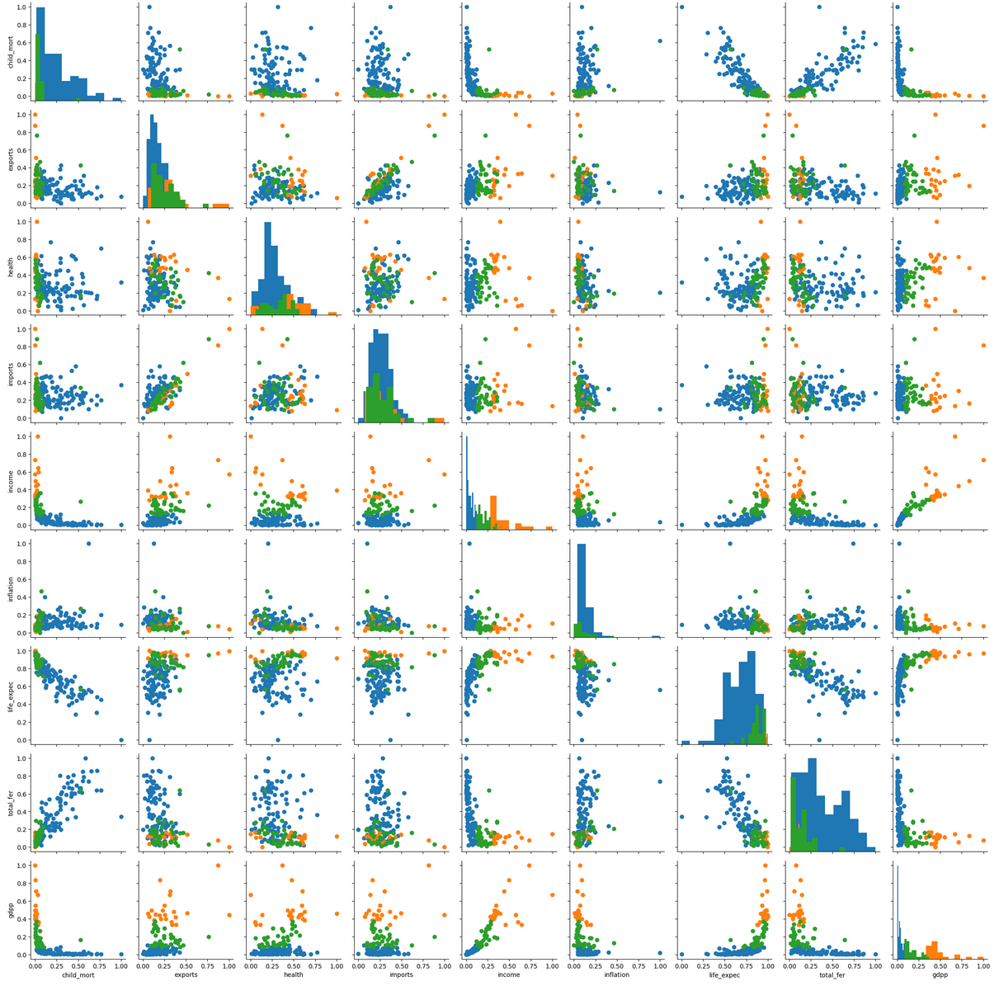

# 🌍 Countries Categorization Project

## 📊 Overview

This project groups 167 countries based on socio-economic and health factors to determine their development status using K-means clustering. The analysis successfully identifies three distinct development categories with clear economic and health patterns.

## 📁 Dataset Attributes
  
- 🏴‍☠️ **country**: Name of the country
- 👶 **child_mort**: Death rate of children under 5 years of age per 1000 live births
- 📤 **exports**: Exports of goods and services per capita (% of GDP per capita)
- 🏥 **health**: Total health spending per capita (% of GDP per capita)
- 📥 **imports**: Imports of goods and services per capita (% of GDP per capita)
- 💰 **income**: Net income per person
- 📈 **inflation**: Annual growth rate of total GDP
- 🎂 **life_expec**: Average life expectancy of newborns
- 👨‍👩‍👧‍👦 **total_fer**: Number of children born per woman
- 🏛️ **gdpp**: GDP per capita

## 🔬 Methodology

- ✅ **Data Loading & Exploration**: Analyzed 167 countries with 9 socio-economic features  
- ✅ **Data Quality**: Verified no missing values in the dataset  
- 📊 **Exploratory Analysis**: Visualized feature relationships through scatter plots, correlation heatmaps, and pair plots  
- ⚖️ **Feature Scaling**: Normalized features using MinMaxScaler for consistent clustering  
- 🎯 **Cluster Selection**: Determined optimal clusters using elbow method and silhouette scores  
- 🎪 **Clustering**: Applied K-means clustering (K=3) with fixed random seed for reproducibility  
- 🏷️ **Cluster Labeling**: Converted numeric clusters to descriptive development categories  

## 📈 Results & Analysis

### Cluster Performance

- **Silhouette Score**: 0.343, indicating fair separation between clusters  
- **Clear Development Progression**: Distinct patterns across all socio-economic metrics  

### Development Categories Identified

#### 🟪 Least Developed Countries (27.5% of dataset)

- Critical child mortality: 93.3 per 1000 live births  
- Low economic development:  
  - GDP per capita: \$1,696  
  - Income per person: \$3,517  
- Challenging health conditions:  
  - Life expectancy: 59.4 years  
  - Health spending: 6.3% of GDP  
- Economic instability: High inflation (12.1%)  
- Representative countries: Afghanistan, Angola, Benin, Burkina Faso, Uganda, Zambia  

#### 🟥 Developing Countries (52.1% of dataset - majority)

- Moderate child mortality: 22.2 per 1000 live births  
- Growing economies:  
  - GDP per capita: \$6,833  
  - Income per person: \$12,914  
- Improving health outcomes:  
  - Life expectancy: 72.6 years  
  - Health spending: 6.2% of GDP  
- Economic transition: Variable inflation (7.5%)  
- Representative countries: Albania, Algeria, Argentina, Brazil, Colombia, Vietnam  

#### 🟦 Developed Countries (20.4% of dataset)

- Very low child mortality: 4.8 per 1000 live births  
- High economic indicators:  
  - GDP per capita: \$43,897  
  - Income per person: \$46,409  
- Excellent health outcomes:  
  - Life expectancy: 80.4 years  
  - Health spending: 8.9% of GDP  
- Economic stability: Low inflation (2.6%)  
- Representative countries: Australia, Austria, Belgium, United States, United Kingdom, Switzerland  

## 🔍 Key Insights

### Economic-Health Relationships

- Strong positive correlation between income and life expectancy across all development levels  
- Child mortality shows the strongest inverse relationship with economic development  
- Health spending increases with development level (6.3% → 6.2% → 8.9% of GDP)  

### Development Distribution Patterns

- Majority in transition: 52.1% of countries are in developing stage  
- Significant development gap: Clear separation between least developed and other categories  
- Economic progression: Consistent metrics improvement from least developed to developed  

### Model Insights

- Clear cluster coherence with real-world development categories  
- Strong feature importance: Child mortality and GDP per capita as key differentiators  
- Transitional patterns: Developing countries show intermediate characteristics  

## 📊 Visualizations

### Feature Correlation Analysis


Heatmap showing strong relationships between child mortality, GDP, and life expectancy across countries

### Cluster Selection


*Elbow method indicating optimal cluster count at K=3 based on inertia reduction*



*Silhouette analysis confirming K=3 provides the best cluster separation with score of 0.343*

### Cluster Results


Clear inverse relationship: high child mortality correlates with low GDP per capita



Economic stability pattern: developed nations show lower inflation with higher GDP



Three distinct development clusters showing progression from least developed to developed countries 

## 💼 Business Applications

### Policy & Development

- 🎯 Targeted interventions: Focus resources on least developed countries for maximum impact  
- 📊 Development monitoring: Track country progression through development stages  
- 💰 Resource allocation: Optimize aid distribution based on cluster characteristics  

### Economic Analysis

- 📈 Investment planning: Identify emerging markets in developing countries  
- 🌍 Regional development: Analyze geographic patterns in development status  
- 🔮 Progress forecasting: Model development pathways for transitioning nations  

### Healthcare Strategy

- 🏥 Public health prioritization: Address critical child mortality in least developed nations  
- 💊 Healthcare investment: Allocate resources based on development-specific needs  
- 📋 Policy evaluation: Measure intervention effectiveness across development stages  

## 🎯 Conclusion

This clustering analysis successfully categorizes countries into meaningful development stages that align with real-world economic and health indicators. The data-driven framework provides valuable insights for international development analysis, policy targeting, and resource allocation strategies. The clear progression from least developed to developed countries across all socio-economic metrics demonstrates the robustness of the clustering approach and its practical applicability for global development initiatives.

## 🛠️ Technical Implementation

### Usage

```bash
# Install dependencies
pip install -r requirements.txt

# Run the Jupyter notebook to explore analysis and results
jupyter notebook country_clustering_analysis.ipynb
