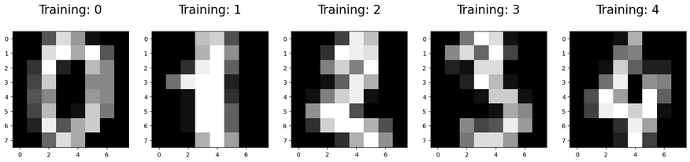
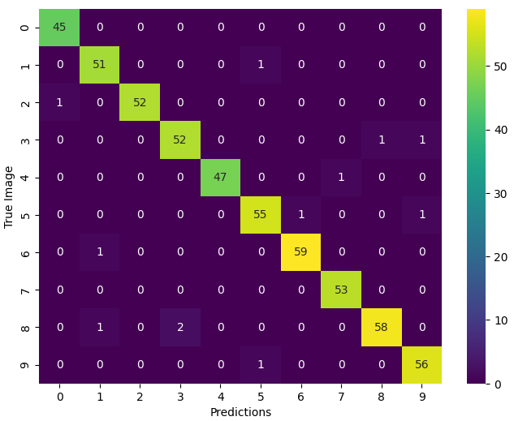
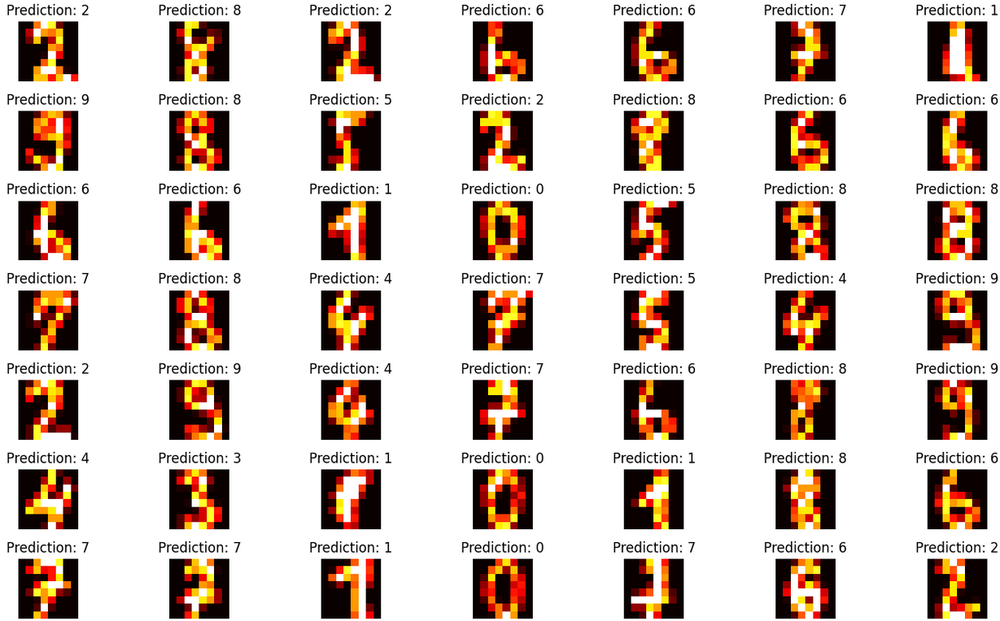

# Random Forest Digit Recognition

## Overview
Advanced machine learning project implementing Random Forest classification on the sklearn load_digits dataset. Features comprehensive image preprocessing with histogram equalization and hyperparameter optimization using GridSearchCV, achieving **98% accuracy** in handwritten digit recognition.

## 🎯 Project Highlights
- **98% Accuracy** on 8x8 pixel handwritten digit classification
- **Advanced Image Preprocessing** with histogram equalization
- **Hyperparameter Optimization** tuning n_estimators via GridSearchCV
- **Comprehensive Evaluation** with precision, recall, F1-score, and confusion matrix
- **Error Analysis** identifying challenging digit patterns

## Technologies & Methods
- **Random Forest Classifier** with ensemble learning
- **GridSearchCV** for hyperparameter optimization (n_estimators: 309, 310, 311)
- **Image Preprocessing**: Histogram equalization and intensity rescaling
- **Model Evaluation**: Accuracy, Precision, Recall, F1-Score, Confusion Matrix
- **Data Visualization**: Sample predictions and error analysis

## 📊 Model Performance
| Metric | Score |
|--------|-------|
| **Accuracy** | 98% |
| **Precision** | 98% |
| **Recall** | 98% |
| **F1-Score** | 98% |

## 🔍 Technical Insights
- **Optimal n_estimators**: 310 trees provided peak performance
- **Preprocessing impact**: Histogram equalization enhanced feature discrimination
- **Most challenging digit**: "8" showed highest misclassification rate
- **Dataset**: 1,797 samples of 8x8 pixel handwritten digits

## 📊 Results & Visualizations

### Model Performance
- **98% Accuracy** on test set
- **Hyperparameter optimized** (310 estimators via GridSearchCV)
- **Robust performance** across all digit classes

### Training Examples


*Examples of handwritten digits from the training dataset*

### Confusion Matrix


*Confusion matrix showing excellent classification performance with minimal misclassifications*

### Sample Predictions  


*Random sample of digit predictions showing model's accurate classification capabilities*

## 🚀 Quick Start

```bash
# Install dependencies
pip install -r requirements.txt

# Run the Jupyter notebook to explore analysis and results
jupyter notebook random_forest_digit_recognition.ipynb
```
