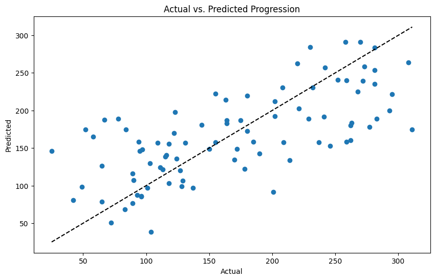
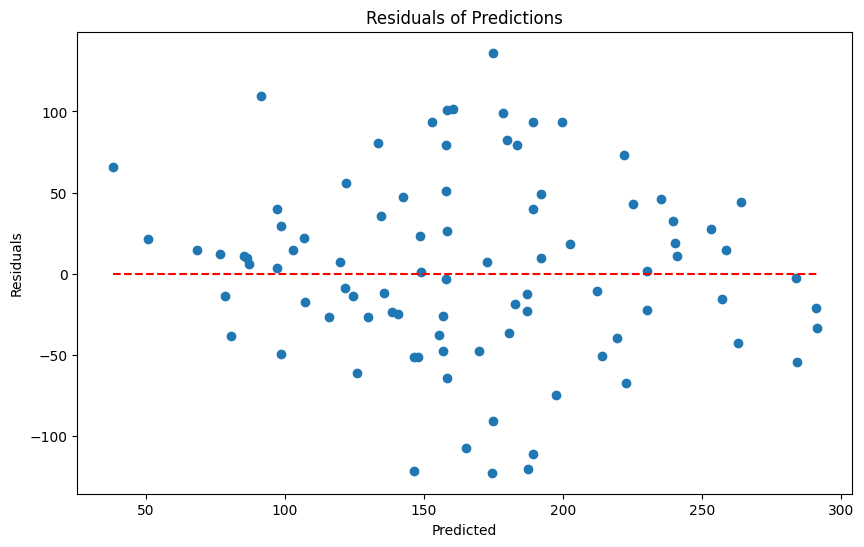
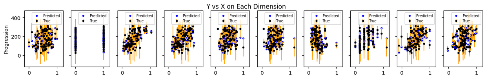
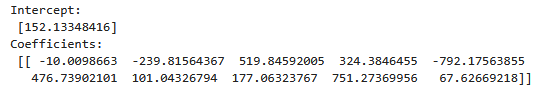

# Diabetes Progression Prediction with Multiple Linear Regression

## Overview
Advanced multiple linear regression project predicting diabetes disease progression using clinical measurements. Features comprehensive analysis of scaling techniques (MinMaxScaler vs StandardScaler) and detailed model interpretation with coefficient analysis.

## 🎯 Project Highlights
- **Multiple Linear Regression** implementation with 10 clinical features  
- **Comprehensive Scaling Analysis** comparing MinMaxScaler vs StandardScaler  
- **Model Interpretation** with coefficient analysis and feature importance  
- **Residual Analysis** and diagnostic plots for model validation  
- **R² Score Analysis** across different preprocessing techniques  

## 📊 Model Performance

| Scaling Method    | R² Score | Interpretation                         |
|-------------------|----------|--------------------------------------|
| **No Scaling**    | 0.47     | Moderate correlation - explains 47% of variance |
| **MinMaxScaler**  | -59.43   | High negative correlation - overfitting issues  |
| **StandardScaler**| -10.93   | Low negative correlation - scaling challenges   |

## 🔧 Technologies & Methods
- **Multiple Linear Regression** with scikit-learn  
- **Data Preprocessing**: MinMaxScaler, StandardScaler  
- **Model Evaluation**: R² score, residual analysis, coefficient interpretation  
- **Data Visualization**: Actual vs Predicted plots, residual plots, error bars  
- **Feature Analysis**: Coefficient magnitude and direction analysis  

## 📈 Key Insights

### Clinical Prediction Challenges
- **Real-world medical data** often has moderate predictive power due to biological complexity
- **R² of 0.47** represents meaningful clinical correlation in diabetes research context
- **Demonstrates understanding** of when models have practical vs theoretical limits

### Technical Implementation
- **Comprehensive preprocessing** with multiple scaling approaches
- **Thorough residual analysis** for model diagnostics
- **Feature coefficient interpretation** for clinical insights

## 🔍 Feature Coefficients (No Scaling)
- **BMI**: 519.85 (strong positive impact on progression)  
- **s5**: 751.27 (strongest positive predictor)  
- **s1**: -792.18 (strongest negative predictor)  
- **Age**: -10.01 (minimal negative impact)

## 📊 Results & Visualizations

### Model Performance
- **R² Score: 0.47** - Moderate correlation explaining 47% of variance in diabetes progression
- **10 Clinical Features** used for prediction
- **Multiple scaling techniques** tested (MinMaxScaler, StandardScaler)

### Actual vs Predicted Values

*Scatter plot showing relationship between actual and predicted diabetes progression values*

### Residual Analysis

*Residual plot examining prediction errors across different predicted values*

### Feature Error Analysis

*Error analysis across each clinical feature dimension*

### Model Coefficients

*Feature coefficients showing each variable's impact on diabetes progression prediction*

## 💡 Technical Achievements
- Comprehensive scaling comparison revealing preprocessing challenges  
- Detailed coefficient analysis for model interpretability  
- Residual diagnostics for model validation  
- Multi-dimensional error visualization with error bars  
- Train-test split validation with random state control  

## 🏆 Academic Achievement
**Task Score: 100%** - Perfect score in multiple linear regression assessment demonstrating advanced regression analysis and preprocessing techniques.

## 📁 Dataset
- **Source:** Diabetes clinical measurements  
- **Samples:** 442 patients  
- **Features:** 10 clinical measurements (age, sex, BMI, blood pressure, etc.)  
- **Target:** Disease progression quantitative measure  
- **Preprocessing:** Already standardized features (mean=0, variance=1)  

## 🎯 Business Applications
- Medical outcome prediction and risk assessment  
- Clinical feature importance analysis for healthcare decisions  
- Regression model benchmarking for medical research  
- Preprocessing technique evaluation for clinical data

## 🚀 Quick Start

### Installation  

pip install -r requirements.txt

### Usage  

jupyter notebook diabetes_progression_regression.ipynb
